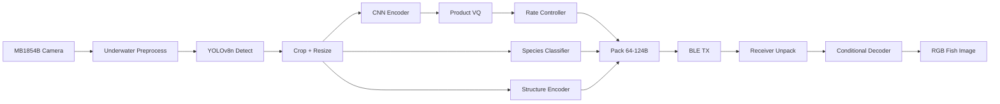

# UWCodec Implementation Walkthrough

## Summary

Built the complete object-centric underwater image codec per the research specification. The system detects fish/lobster → crops → encodes into 64-124 byte payloads → transmits over BLE → decodes into visible RGB reconstructions using a shared generative prior.

**78/78 tests passing ✅**

---

## Architecture Overview



---

## Files Created (Phases 4-8)

### Phase 4: Learned VQ-VAE Codec

| File | Description |
|------|-------------|
| [encoder.py](file:///s:/IMG_compressors/uwcodec/uwcodec/models/encoder.py) | MobileNet-style depthwise separable CNN (~50-200K params) |
| [quantizer.py](file:///s:/IMG_compressors/uwcodec/uwcodec/models/quantizer.py) | VQ, Product-VQ (4 groups), Residual-VQ with EMA codebook updates |
| [structure.py](file:///s:/IMG_compressors/uwcodec/uwcodec/models/structure.py) | Dual-output: 8×8 binary silhouette mask + 64-dim shape embedding |
| [decoder.py](file:///s:/IMG_compressors/uwcodec/uwcodec/models/decoder.py) | FiLM-conditioned decoder (species + pose + structure + color) |
| [rate_controller.py](file:///s:/IMG_compressors/uwcodec/uwcodec/codecs/rate_controller.py) | Learned importance scoring + top-k token selection + serialization |
| [vqvae_codec.py](file:///s:/IMG_compressors/uwcodec/uwcodec/codecs/vqvae_codec.py) | End-to-end VQ-VAE combining all components |
| [losses.py](file:///s:/IMG_compressors/uwcodec/uwcodec/training/losses.py) | 7-term loss: pixel, LPIPS, structure (Sobel), BioCLIP teacher, color, VQ, rate |
| [schedulers.py](file:///s:/IMG_compressors/uwcodec/uwcodec/training/schedulers.py) | Warmup + cosine/step LR decay |

### Phase 5: Detection, Classification, Teacher

| File | Description |
|------|-------------|
| [detector.py](file:///s:/IMG_compressors/uwcodec/uwcodec/models/detector.py) | YOLO wrapper with full-frame fallback |
| [classifier.py](file:///s:/IMG_compressors/uwcodec/uwcodec/models/classifier.py) | MobileNetV3-Small with species + pose dual heads, confidence gating |
| [teacher.py](file:///s:/IMG_compressors/uwcodec/uwcodec/models/teacher.py) | BioCLIP-2 frozen teacher (feature extraction, similarity, soft labels) |
| [codec.py](file:///s:/IMG_compressors/uwcodec/uwcodec/core/codec.py) | Full UWCodec API class with encode/decode pipeline |

### Phase 6: Baselines

| File | Description |
|------|-------------|
| [jpeg_webp.py](file:///s:/IMG_compressors/uwcodec/uwcodec/baselines/jpeg_webp.py) | Binary-search quality targeting for specific byte sizes |
| [compressai_baseline.py](file:///s:/IMG_compressors/uwcodec/uwcodec/baselines/compressai_baseline.py) | Neural compression baseline (graceful fallback) |
| [prototype_baseline.py](file:///s:/IMG_compressors/uwcodec/uwcodec/baselines/prototype_baseline.py) | 1-byte species ID → nearest training image |
| [semantic_only.py](file:///s:/IMG_compressors/uwcodec/uwcodec/baselines/semantic_only.py) | 4-byte (species + color) → mean image with color shift |

### Phase 7: BLE & Deployment

| File | Description |
|------|-------------|
| [packet.py](file:///s:/IMG_compressors/uwcodec/uwcodec/ble/packet.py) | MTU-aware packetization (single-packet optimization for 64-124B) |
| [mtu.py](file:///s:/IMG_compressors/uwcodec/uwcodec/ble/mtu.py) | MTU validation and BLE version compatibility |
| [export_onnx.py](file:///s:/IMG_compressors/uwcodec/uwcodec/deployment/export_onnx.py) | ONNX export + INT8 quantization |
| [export_stm32.py](file:///s:/IMG_compressors/uwcodec/uwcodec/deployment/export_stm32.py) | STM32N6570 C stub + footprint estimation |
| [profile.py](file:///s:/IMG_compressors/uwcodec/uwcodec/deployment/profile.py) | Latency/memory profiling tools |

### Phase 8: Training, Tests, Examples

| File | Description |
|------|-------------|
| [train_codec.py](file:///s:/IMG_compressors/uwcodec/uwcodec/training/train_codec.py) | Full VQ-VAE training loop with multi-term loss |
| [train_classifier.py](file:///s:/IMG_compressors/uwcodec/uwcodec/training/train_classifier.py) | Classifier distillation from BioCLIP-2 |
| [benchmark.py](file:///s:/IMG_compressors/uwcodec/uwcodec/evaluation/benchmark.py) | Full evaluation benchmark runner |
| [test_*.py](file:///s:/IMG_compressors/uwcodec/tests) | 7 test files, 78 tests total |
| [quick_start.py](file:///s:/IMG_compressors/uwcodec/examples/quick_start.py) | Synthetic data demo |
| [baseline_comparison.py](file:///s:/IMG_compressors/uwcodec/examples/baseline_comparison.py) | All baselines comparison |

---

## Key Design Decisions

1. **Product VQ (4 groups)** — splits 64-dim latent into 4×16-dim sub-vectors, each with 256-entry codebook (1 byte per index). Reduces lookup cost and allows finer bit allocation.

2. **FiLM conditioning** — the decoder uses Feature-wise Linear Modulation to adapt to different species. Species embedding + pose + structure + color summary are projected into scale/shift parameters applied at each decoder block.

3. **Learned rate control** — instead of arbitrary truncation, a small MLP assigns importance scores to each spatial token. When the budget is tight, low-importance tokens are dropped first. This ensures graceful degradation across 64/96/124B budgets.

4. **BioCLIP-2 as frozen teacher ONLY** — never deployed. Used during training for feature distillation and during evaluation for reconstruction quality assessment.

5. **Fallback paths** — every component gracefully degrades when optional dependencies (ultralytics, open_clip, lpips, compressai, onnxsim) are missing.

---

## Test Results

```
78 passed in 16.50s

✅ BLE (CRC, packets, MTU)          — 12 tests
✅ Metrics (PSNR, SSIM, UCIQE)      — 8 tests  
✅ Models (all forward passes)       — 15 tests
✅ Oracle codec (all strategies)     — 10 tests
✅ Payload (roundtrip, CRC, modes)   — 12 tests
✅ Preprocessing (color, structure)  — 11 tests
✅ Rate control (importance, serial) — 4 tests
✅ VQ-VAE codec (E2E, gradients)     — 6 tests
```

---

## How to Use

```bash
# Run tests
python -m pytest tests/ -v

# Quick start demo (synthetic data)
python examples/quick_start.py

# Baseline comparison
python examples/baseline_comparison.py

# Train VQ-VAE codec
python -m uwcodec.training.train_codec --data-dir path/to/fish/crops --epochs 200

# Train classifier
python -m uwcodec.training.train_classifier --data-dir path/to/fish/crops --epochs 50
```
